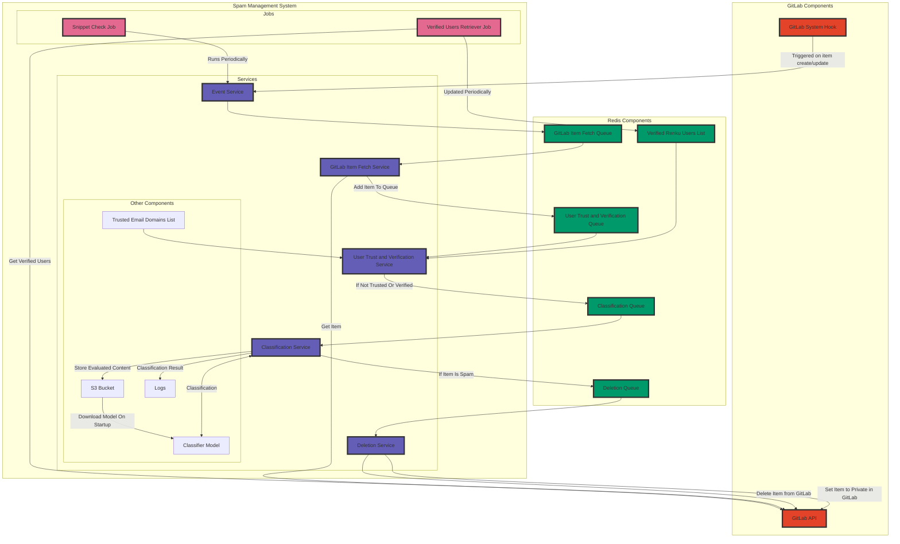

# Spamphibian

Spamphibian is in a very early development stage. It is a scalable and low-latency spam detection and management service for GitLab, designed to identify, classify, and handle potential spam activities using machine learning models. The service is implemented in Python and uses the GitLab API and Redis.

## Table of Contents

- [Spamphibian](#spamphibian)
  - [Table of Contents](#table-of-contents)
  - [Overview](#overview)
  - [Limitations](#limitations)
  - [Installation](#installation)
    - [Using Helm](#using-helm)
    - [Using Docker](#using-docker)
    - [Using Docker Compose](#using-docker-compose)
    - [Using Python](#using-python)
  - [Monitoring](#monitoring)
  - [License](#license)

## Overview

Spamphibian uses various components to combat spam, including GitLab API, Redis queues, and multiple jobs and services.

This is the planned architecture of Spamphibian, but it is subject to change:



## Limitations

Currently, Spamphibian only notifies about potential spam activities. It does not take any action on its own. This is planned for a future release.

Additionally, Spamphibian requires a model service to be running. This service is responsible for serving the machine learning models used for classification. An example model service is provided in `models/flask_service.py`. Releasing a basic, general-use model image is planned for the future.

## Installation

Ensure smooth sailing with `spamphibian` by following these concise steps.

Prerequisites:

- GitLab instance
- GitLab admin token
- Slack webhook URL
- Redis instance (this can be the same as the one used by GitLab, but use a dedicated database. Gitlab usually uses database 0, so use 1, for example)
- Model service (see `models/flask_service.py` for an example)
  
### Using Helm

   ```bash
   helm repo add renku https://swissdatasciencecenter.github.io/helm-charts/
   helm install spamphibian renku/spamphibian -f your-values-file.yaml
   ```

### Using Docker

   ```bash
   docker run --name spamphibian -e REDIS_HOST="localhost" -e GITLAB_URL="https://gitlab.example.com" -e GITLAB_TOKEN="glpat-abc" -e SLACK_WEBHOOK_URL="https://hooks.slack.com/services/a/b/c" -e MODEL_URL="http://localhost:5001" -p 8000:8000 renku/spamphibian
   ```

### Using Docker Compose

   ```bash
   docker-compose up
   ```

### Using Python

1. Install prerequisites.

    ```bash
    pip install -r requirements.txt
    ```

2. Set environment variables.

    ```bash
    export GITLAB_URL="https://gitlab.example.com"
    export GITLAB_TOKEN="glpat-abc"
    export SLACK_WEBHOOK_URL="https://hooks.slack.com/services/a/b/c"
    export REDIS_HOST="localhost"
    export MODEL_URL="http://localhost:5001"
    ```

3. Run the service.

    ```bash
    python main.py
    ```

After Spamphibian is up and running, create a GitLab System Hook through the GitLab admin portal. Point the hook to the `/events` endpoint of Spamphibian. The hook should be triggered on all system-level spam-related events.

## Monitoring

Spamphibian exposes a Prometheus endpoint on port 8000 at `/metrics`.

## License

Spamphibian is licensed under the [Apache 2.0 license](LICENSE).
