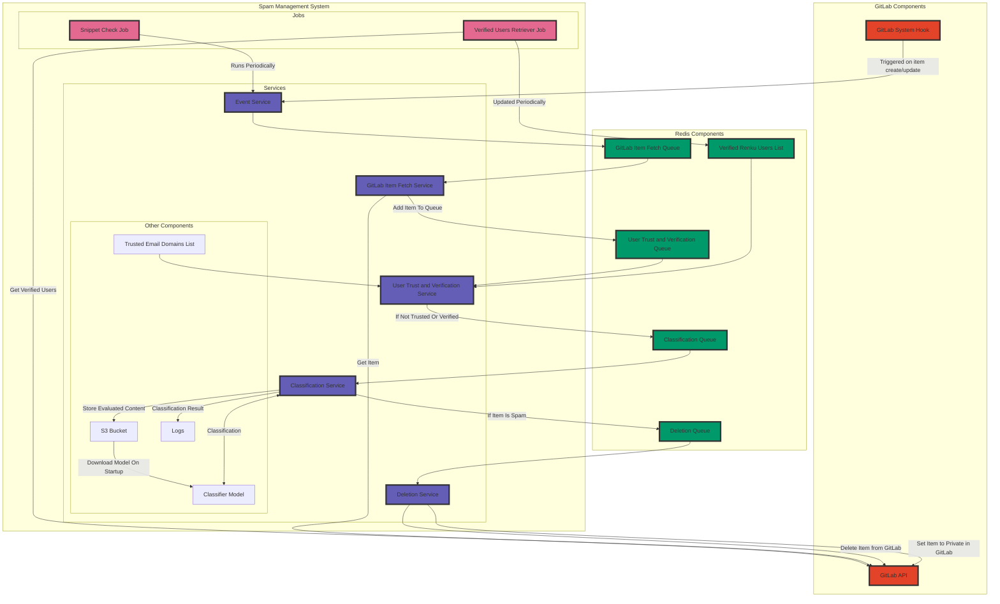

# Spamphibian

Spamphibian is in a very early development stage. It is a scalable and low-latency spam detection and management service for GitLab, designed to identify, classify, and handle potential spam activities using machine learning models. The service is implemented in Python and uses the GitLab API and Redis.

## Table of Contents

- [Spamphibian](#spamphibian)
  - [Table of Contents](#table-of-contents)
  - [Overview](#overview)
  - [Installation](#installation)
  - [Usage](#usage)
  - [Contributing](#contributing)
  - [License](#license)

## Overview

Spamphibian uses various components to combat spam, including GitLab API, Redis queues, and multiple jobs and services.

This is the planned architecture of Spamphibian, but it is subject to change:

## Installation

Coming soon!

## Usage

Spamphibian is in a very early development stage. It is not yet ready for production use and currently requires manual configuration and bespoke components to be built to get it working. The following steps are necessary to get it working:

The following environment variables are required:

- `GITLAB_URL`: The URL of the GitLab instance to connect to.
- `GITLAB_TOKEN`: The token to use to authenticate with the GitLab instance, which must have admin privileges.
- `SLACK_WEBHOOK_URL`: The URL of the Slack webhook to use to send notifications.

Install the dependencies in `requirements.txt` using `pip install -r requirements.txt`.

A local Redis instance is required to run the service, which can be started using `docker run --env=ALLOW_EMPTY_PASSWORD=yes --runtime=runc -p 6379:6379 -d bitnami/redis:latest`, for example.

A web service that evaluates the data from GitLab is required to run the service. An example evaluation service can be found in `classification_service/flask_service.py`. Beware that this example service requires a preprocessing pipeline and Keras model to be present and will not work out of the box currently. A simple script training model will be published in the future, so these components can be built easily using your own GitLab data.

A system hook must be configured on the GitLab instance to send notifications to the service. The URL of the Spamphibian service must be configured in the system hook.

Currently, Spamphibian only evaluates `user_create` and `user_rename` events.

Spamphibian can then be started using `python main.py`.

## Contributing

Contributions are welcome! Please read the contributing guidelines in the `CONTRIBUTING.md` file before making any contributions.

## License

Spamphibian is under the [MIT License](LICENSE).
